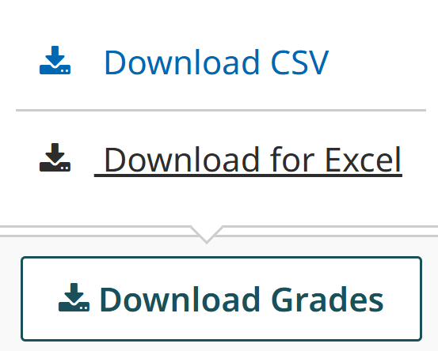
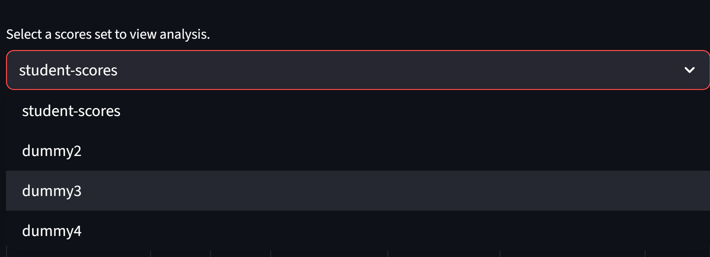
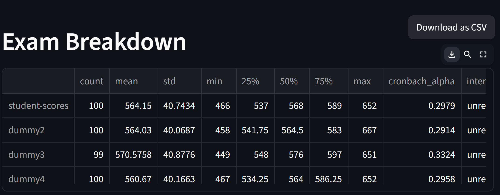
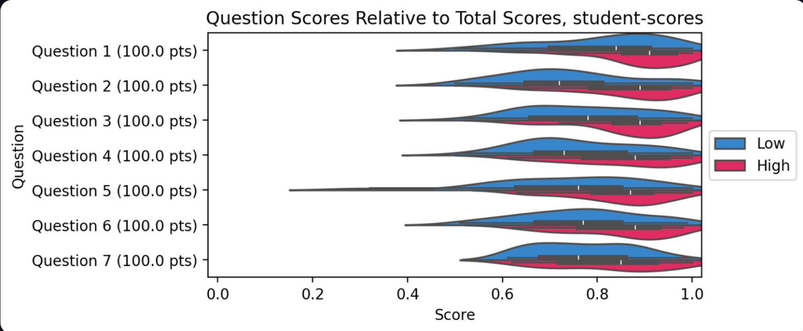

# WUCT Exam Review
Quantification of exam statistics for analysis of question quality.

## Preparations
***Download*** grades from [Gradescope](https://www.gradescope.com) as a **csv file**.

***Alternatively***, format your excel spreadsheet exactly as follows: name the ID column `Name`, the column for total earned score `Total Score`, and columns recording scores for each question `Question x (y.y pts)`, where `x` is the numbering of the question and `y.y` is the maximum available points for this question in decimal (must contain the decimal point). Save it as a **csv file**.

## Usage

***Upload*** the csv files for multiple exams at once by drag and drop or by clicking the `Browse files` button. The statistics and visualizations will load automatically. 

***Select*** from the dropdown an exam to review in the Question Breakdown section. The statistics for each question in that exam will be calculated and displayed below.

To ***save*** the tables, hover over and click the download button on the upper right corner. To ***save*** the plots, right click and select `Save image as...` from the menu.

## Interpretation Notes

1. **Cronbach's $\alpha$**
   
   Cronbach's $\alpha$ is a measure of the **internal consistency** of an exam or the relatedness of its questions. It measures if the exam questions are testing the same underlying construct (in the case of WUCT, chemistry knowledge). Statistically, it is defined as the contribution of the covariance terms between items to the total variance of the summed score:  
   $$\alpha = \frac{k}{k-1}\left( 1 - \frac{\sum\_{i=1}^{k} \sigma\_i^2}{\sigma\_X^2} \right)$$, 
   where $k$ is the number of items, $\sigma_i^2$ is the variance of the $i^{th}$ item, and $\sigma_X^2$ is the variance of the total score. The correction term $\frac{k}{k-1}$ is to make it an unbiased estimator. Cronbach's $\alpha$ has a range of $0-1$.  
    
   A higher Cronbach's $\alpha$ indicates that the exam is more consistent in testing the same construct. A Cronbach's $\alpha$ higher than $0.9$ is considered excellent and colored green, $0.7 - 0.9$ is considered acceptable and colored orange, and $<0.7$ is considered poor and colored red. 
    
   Note that Cronbach's $\alpha$ increases naturally with the number of items. Some also suggest that a Cronbach's $\alpha$ greater than 0.95 indicates redundancy of questions.

3. **Discrimination Index**
   
   Discrimination index (DI) measures how well a question distinguishes high-scorers from low-scorers. It quantifies how much better a high-scorer performs on each individual item than a low-scorer, and is calculated by taking the difference in average normalized question scores between groups with total exam scores within the top 27% (high group) and the bottom 27% (low group):  
   $$DI = \bar{C}\_{high} - \bar{C}\_{low}$$, 
   where $\bar{C}$ is the average normalized question score within each group. 

   $DI$ ranges from -1 to 1. Normally, for a discriminating question (like one in WUCT), a larger $DI$ is preferred. $DI>0.6$ is considered good and colored green, $0.3-0.6$ is acceptable and colored blue, and $0-0.3$ is poor and colored orange. A negative $DI$ with red coloring indicates that overall low-scorers did better on that question than overall high-scorers, which is undesirable and requires review.

5. **Violin Plots**
   
   A violin plot is a compact way of showing the distribution of data by combining a box plot with a kernel density estimate (KDE) plot. More data are distributed where the "violin" is wider, and fewer where the "violin" is thinner. Shown below is an example of a violin plot with box plots overlay showing the distribution of normalized question scores, colored by discrimination index.
   
   

6. **Layered Violin Plots**
   
   The last plot in the `Question Breakdown` section is a layered violin plot. It shows on top the question score distribution for the group with overall exam scores within the lower 50% percentile, and shows on bottom the question score distribution for the higher 50% group. For a discriminating question, the distribution of the high group should be skewed to the right compared to that of the low group. Shown below is an example; note how the distribution of the high group (red) is shifted right compared to the low group (blue) for questions 2 and 3.
   
   
